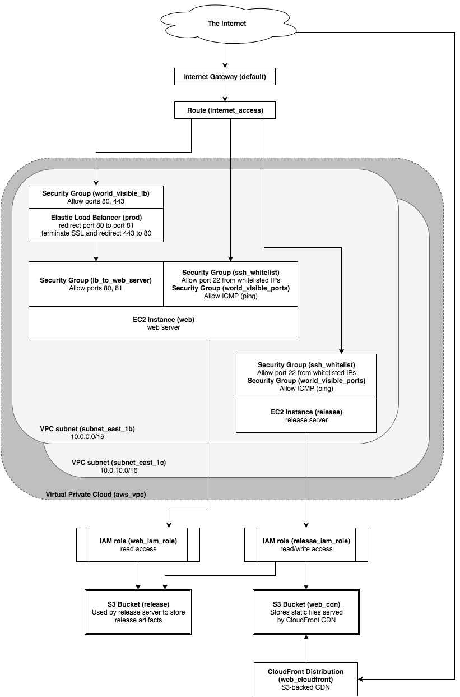

# aws-basic-config
A server topology covering most basic features.

#### Installation

Before you get started, you will need to install `terraform`, which you can download at https://www.terraform.io/downloads.html.

#### Preflight checklist

Before you run `terraform` to create your infrastructure, you need to complete the following tasks:

1. Register a domain (e.g., `everythingisawesome.com`).
1. Sign up for AWS.
1. Request a cert in the AWS certificate manager. This terraform configuration expects you to have a wildcard cert (e.g., `*.everythingisawesome.com`). Note that you will need to be able to confirm ownership of the site by clicking a link in an email. Once you've created this cert, note the "arn" value - you'll use it below.
1. Create a keypair (e.g., `everythingisawesome-keypair`) on the AWS EC2 page. This will download a PEM file to your computer. Move the PEM file to your `~/.ssh` directory and add it to your `ssh-agent`. Note that this isn't a good solution for a production system, but will do for a test system. Also, note that you can't get another copy of the PEM file from AWS, so you should save it someplace safe and secure.
  ```
cd ~/Downloads
mv everythingisawesome-keypair.pem ~/.ssh
chmod 400 ~/.ssh/everythingisawesome-keypair.pem
ssh-add ~/.ssh/everythingisawesome-keypair.pem
```

Now that you have the required prerequisites, you will need to change a couple of values in the `terraform/variables.tf` file.

```
variable "domain_name" {
  default = "everythingisawesome"
}
variable "key_name" {
  default = "everythingisawesome-keypair"
}
variable "cert_arn" {
  default = "arn:aws:acm:us-east-1:....."
}
variable "my_ip_address" {
  default = "<your ip address here>/32"
}
```

#### Thundercats are Go!

At this point, you should be able to go ahead and run terraform.

```
cd aws-basic-config/terraform
terraform plan
# confirm that there are no errors
terraform apply
```

#### DNS

After you've generated the infrastructure, you will need to switch the DNS over to your new stack. There will be four nameservers in the NS record in the AWS Route 53 public hosted zone, and you should go to your registrar and set the domain name servers to these four servers. You should also copy any mail-related records over to your Route 53 public hosted zone.

#### Tear down

If you want to delete your infrastructure, you can do it like so:

```
terraform destroy
<type "yes" at prompt>
```

**Note**: You may have to manually delete the CloudFront distribution in AWS after the fact, since it takes it so friggin' long to turn it off that `terraform` doesn't always succeed in deleting it.


